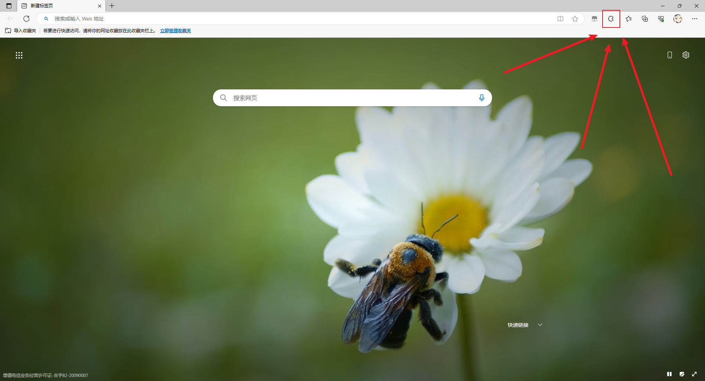

# Edge 浏览器

## 进入扩展加载项

- 打开 Edge 浏览器，点击图片所示位置（浏览器**右上角**）。

  

- 紧接着，会出现一个弹出框，我们点击“**[打开 Microsoft Edge 加载项](https://microsoftedge.microsoft.com/addons/Microsoft-Edge-Extensions-Home)**”。

  

## 搜索、安装油猴

- 我们进入新的页面后，会发现左侧有个搜索框，我们点击它。

  

- 随后，我们搜索**tamper monkey**，并点击获取。

  

  

  
提示

  - 如果你的浏览器并未安装油猴，箭头所指的地方会显示获取。

  - 由于博主已经安装了油猴，所以显示删除。

  

## 打开油猴、添加脚本

- 我们点击箭头所指的地方，打开油猴。

  

- 随后，我们点击管理面板。

  

- 我们进入管理面板后，我们点击红色箭头所指的“**加号**”。

  

  

  
提示

  - 如果你没有安装任何油猴脚本，在图中紫色方框圈住的部分是一片空白的，这是正常的！

  - 像我这里显示了两行内容，就说明我有两个脚本，以此类推。

  

- 这时候，我们会跳转到这个页面中。

  我们只需要将对应的 js 代码复制粘贴至该页面中，随后按下“**Ctrl+S**”即可。

  油猴会自动帮我们创建好脚本，随后在管理面板中就可以看见刚刚创建的脚本了。

  

  

  
注释的含义

  - 这些由油猴生成的 JS 注释并非普通的注释，它相当于文件的配置项。

  - 说白了，就是声明脚本的相关信息，例如：**作者、版本、描述**等等...

  - 本博客不讲解这些配置项的信息，想要深入了解的话，可以问 **Ai** 或者 **网上搜索**。

  

## 启动脚本

- 最后，我们需要启动脚本，至此，就大功告成了。

  

  

  
油猴，启动！

  - 红色箭头所指的红框代表脚本关闭

  - 紫色箭头所指的紫框代表脚本开启

  

## 测试脚本

- 我们还需要进行测试，看看脚本是否生效

  我们以豆丁网为例，在进入网站后，发现右上角的油猴图标有红色框出现。

  出现这种情况，就代表脚本运行成功。

  而红框中的数字，则代表匹配到的当前页面和嵌套的 iframe 页面。

  

